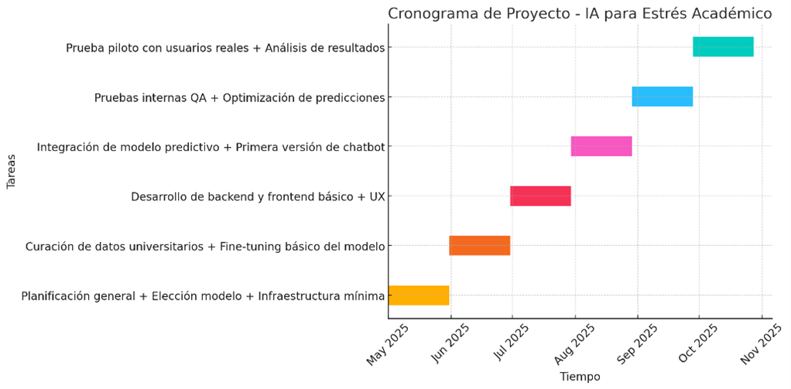
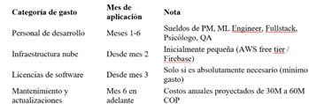

# 🗂️ Administración – OmegaLab 2025

## ¡Bienvenidos a la carpeta de Administración!

Aquí se debe subir **todo el material y documentación** que el área de Administración genere a lo largo del reto OmegaLab 2025.

---

## Planes de organización y gestión del equipo (prefactibilidad)
**Samuel payares-Administrador:** Organización y Gestión del Equipo, Planificación y Seguimiento, Documentación Administrativa, Coordinación General, Control de Entregables.
Samuel Ruidiaz- Diseño: Desarrollar y mantener la identidad visual del proyecto, Diseñar materiales visuales funcionales y atractivos.
Tomas Buitrago- Mercadeo: Realizar estudios de mercado y análisis del público, Diseñar e implementar campañas de difusión.
Santiago Acevedo- desarrollo: Escribir y mantener el código fuente, Realizar pruebas y depuración, Documentar el desarrollo técnico.
## Avances o reportes administrativos
Tareas por fases:  Planificación: definir alcance, modelo, herramientas, cronograma detallado; curación de datos: Recopilar, limpiar y organizar datos académicos históricos; Fine-tuning de IA: Ajustar modelo con base en datos curados; Desarrollo Web/App: Backend para modelo, frontend para chat con estudiante; Integración y Testing: Integrar IA en frontend, prueba de precisión, corrección de errores; Piloto: Lanzamiento pequeño, evaluación de experiencia de usuario, recolección de Feedback.
## Cronogramas, planificaciones, asignaciones de tareas 

1. Project Manager + ML Engineer + Fullstack Developer 2. ML Engineer + Psicólogo 3. Fullstack Developer + UX Designer freelance 4. Fullstack Developer + ML Engineer 5. QA Tester + Project Manager 6. QA Tester + Project Manager + Psicólogo.
## Cualquier otro documento relacionado con la coordinación y administración del proyecto
 

> ℹ️ **Nota:** No es necesario seguir un formato exacto, pero es importante que los archivos estén claros, bien nombrados y actualizados para que los jueces puedan entender el trabajo realizado.

---

¡Buena organización y mucho éxito en el reto! 🚀
