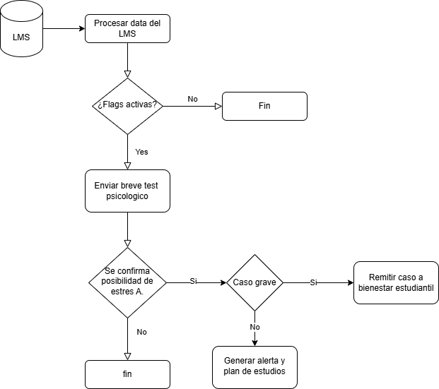
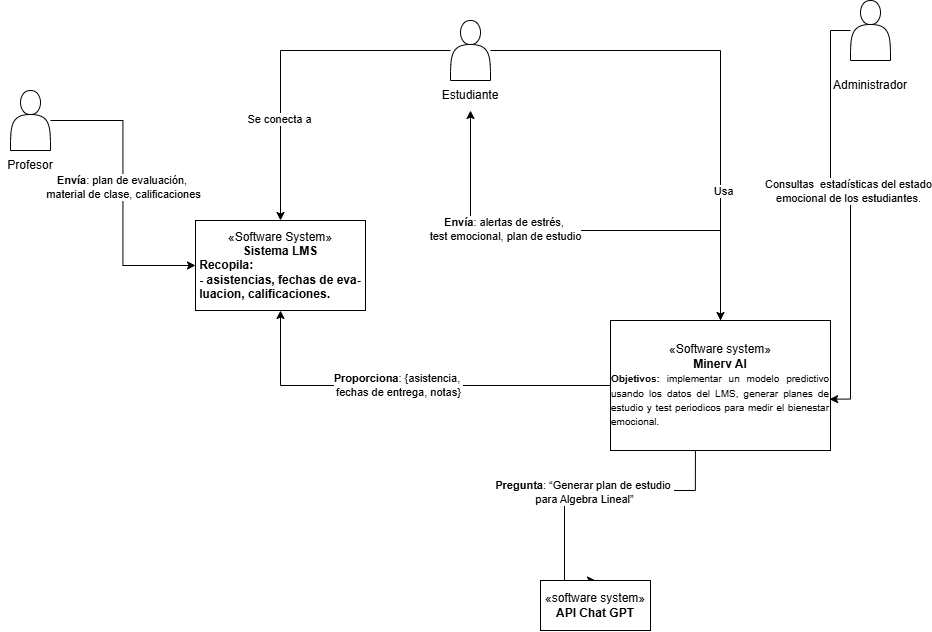

# 💻 Desarrollo – OmegaLab 2025

## ¡Bienvenidos a la carpeta de Desarrollo!

Aquí se debe subir **todo el material y avances técnicos** que el área de Desarrollo genere durante el reto OmegaLab 2025.

---

# Objetivo:
Desarrollar un sistema predictivo/autocorrectivo capaz de identificar estudiantes universitarios en riesgo de sufrir estrés académico, utilizando datos de plataformas educativas y variables psicológicas y contextuales. Una vez identificado el riesgo, se generarán estrategias correctivas para prevenir el avance del estrés. Nuestro sistema se diferencia al ayudar a los estudiantes a crear planes de estudio personalizados y actuar como un monitor personal, utilizando el material de las clases para generar explicaciones y contenido gráfico que facilite el logro de sus objetivos académicos.

# Documentación técnica:

## Modelos predictivos a utilizar:

Se empleará una combinación de modelos para mejorar la precisión de las predicciones mediante aprendizaje en conjunto, lo que permite integrar diversas perspectivas y reducir errores individuales. Se espera una precisión superior al 80% en la identificación de estudiantes en riesgo.

### Regresión logística
**Aplicación:** Identificación de factores asociados al estrés académico.  
**Justificación:** Un estudio en la Universidad Politécnica Metropolitana de Hidalgo determinó que la carga académica y las responsabilidades adicionales son factores significativos en el estrés estudiantil.

### Árboles de decisión
**Aplicación:** Clasificación de estudiantes según niveles de estrés.  
**Justificación:** Investigaciones han demostrado que los árboles de decisión predicen eficazmente el nivel de estrés considerando factores académicos, personales, sociales, institucionales y económicos.

### Redes Neuronales Artificiales (Perceptrón Multicapa - MLP)
**Aplicación:** Predicción de efectos fisiológicos causados por el estrés académico.  
**Justificación:** Estudios han utilizado modelos MLP para predecir efectos fisiológicos del estrés, considerando variables como procrastinación, nivel de estrés percibido, edad e ingreso económico.

### Variables Académicas
- **Fechas de Evaluaciones:** Proximidad y acumulación de exámenes y entregas.  
- **Cantidad de Trabajo Asignado:** Número de tareas y proyectos en un período determinado.  
- **Notas:** Descenso en el rendimiento académico.  
- **Inasistencias:** Aumento en la frecuencia de ausencias a clases.

### Referencias 
- Arrogante, O. (2021). Identificación de Causas del Estrés Académico en Estudiantes de la Universidad Politécnica Metropolitana de Hidalgo. Revista RIDE.  
- López Quiroz, L. A., & Soto Salazar, J. G. (2023). Árboles de decisión para la predicción temprana de estrés académico en estudiantes de la Facultad de Ciencias. Universidad Nacional José Faustino Sánchez Carrión.  
- Mora Romo, J., & Martell Muñoz, J. (2021). Predicción de efectos fisiológicos causados por el estrés académico mediante redes neuronales artificiales. Revista Iberoamericana de Psicología.

# 📘 Tecnologías Utilizadas

Este proyecto implementa un sistema predictivo de estrés académico utilizando un enfoque de microservicios, event-driven y generación aumentada por recuperación (RAG).

---

## 🖥️ Frontend

| Componente | Tecnología |
|:-----------|:-----------|
| **Single Page Application** | [React.js](https://reactjs.org/) + JavaScript |

- Proporciona la interfaz para estudiantes y administradores.
- Comunicación vía API REST con el backend.

---

## 🛠️ Backend

| Componente | Tecnología | Función |
|:-----------|:-----------|:--------|
| **API Gateway** | Python + [FastAPI](https://fastapi.tiangolo.com/) | Autenticación, autorización y enrutamiento de peticiones. |
| **LMS Connector** | Python + FastAPI | Sincroniza datos académicos desde el LMS institucional. |
| **Servicio de Predicción de Estrés** | Python + FastAPI + [scikit-learn](https://scikit-learn.org/) / [TensorFlow](https://www.tensorflow.org/) | Predicción de nivel de estrés basado en métricas académicas. |
| **Servicio de Plan de Estudio & Tutoría AI** | Python + FastAPI + [Pinecone](https://www.pinecone.io/) + [OpenAI API](https://platform.openai.com/) | Generación automática de itinerarios de estudio personalizados (RAG). |
| **Servicio de Notificaciones** | Python + FastAPI + [Celery](https://docs.celeryq.dev/en/stable/) (opcional) | Envío de tests emocionales, recordatorios y alertas por diferentes canales. |

---

## 🛢️ Bases de Datos

| Componente | Tecnología |
|:-----------|:-----------|
| **LMS Data** | PostgreSQL |
| **Métricas Académicas DB** | PostgreSQL |
| **DB de Notificaciones** | Redis |
| **Notificator DB (Embeddings)** | Pinecone o Weaviate |

---

## 🔗 Integraciones Externas

| Servicio | Tecnología |
|:---------|:-----------|
| **API LLM** | OpenAI (GPT-4) / Anthropic Claude / Google PaLM |

Utilizados para la generación de planes de estudio, ejemplos y explicaciones personalizadas.

---

## 📩 Comunicación Asíncrona

| Componente | Tecnología |
|:-----------|:-----------|
| **Bus de Eventos** | Apache Kafka |

- Publicación y consumo de eventos académicos (e.g., `lms.data`).
- Activación de procesos asincrónicos (cálculo de estrés, generación de test, envío de notificaciones).

---

## ⚙️ Infraestructura

| Componente | Tecnología |
|:-----------|:-----------|
| **Contenerización** | Docker, Docker Compose |
| **Orquestación (Opcional)** | Kubernetes |
| **Monitorización** | Prometheus + Grafana |
| **Gestión de logs** | ELK Stack (Elasticsearch, Logstash, Kibana) |
| **Autenticación** | OAuth2 / JWT |

---

# 📋 Resumen de Stack

- **Frontend**: React.js  
- **Backend**: Python (FastAPI)  
- **Machine Learning**: scikit-learn o TensorFlow  
- **Bases de Datos**: PostgreSQL + Redis + Pinecone  
- **Mensajería**: Apache Kafka  
- **Generación de Contenido**: OpenAI API / Claude API  
- **Contenedores**: Docker  

---

# 📈 Notas Finales

- El sistema está diseñado para ser escalable y resiliente.  
- El patrón de eventos desacopla los microservicios y facilita la extensibilidad.  
- Se enfoca en intervenciones tempranas para mejorar el bienestar académico de los estudiantes.

### Diagramas:
- **Flujo:**   
- **Contexto:**   
- **Contenedores:** 

> ℹ️ **Nota:** Mantén el contenido organizado, claro y actualizado para facilitar su revisión.

---

¡Mucho éxito programando y creando cosas increíbles! 🚀
