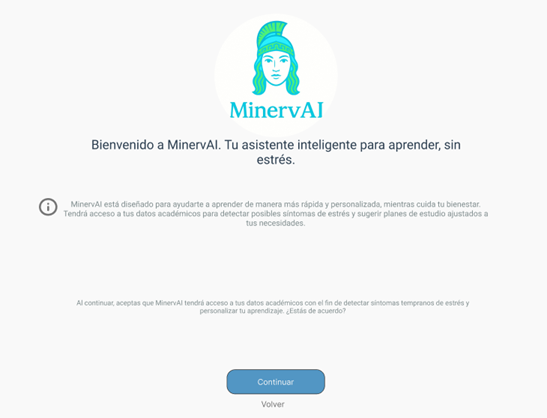
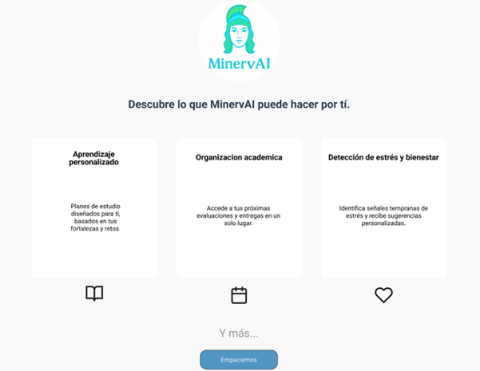
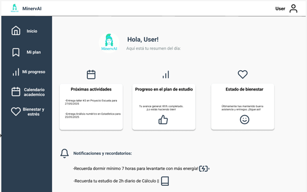

# 🎨 Diseño – OmegaLab 2025

## 📌 Introducción

¡Bienvenidos a la carpeta de Diseño!  
Aquí se debe subir **todo el material visual y creativo** que el área de Diseño genere a lo largo del reto OmegaLab 2025. El diseño es una parte fundamental para transmitir la identidad del proyecto y garantizar una experiencia visual atractiva y profesional.

---

## 🎨 Contenidos de Diseño

### 1. **Logo del Proyecto**
{ width=300px height=300px }

**Paleta de colores:**
- **Mint Blue (#AEE6E6):** Transmite frescura, claridad mental y serenidad.  
- **Azul Profundo (#05445E):** Representa confianza, serenidad y profesionalismo.  
- **Blanco Humo (#F9F9F9):** Evoca ligereza y un espacio limpio.  

**Tipografías:**
- **Poppins Bold, Poppins Medium:** Aportan un aire juvenil y profesional.  
- **Roboto Regular:** Fácil de leer en pantalla, ideal para aplicaciones educativas y de bienestar.

> **Nota:** La combinación de colores y tipografías busca reflejar los valores del proyecto: innovación, profesionalismo y accesibilidad.

---

### 2. **Mockups del Proyecto**

Los mockups son representaciones visuales que muestran cómo se verá el sistema en diferentes dispositivos. Estos ayudan a validar el diseño antes de su implementación.

- **Mockup 1:**  
  

- **Mockup 2:**  
  

- **Mockup 3:**  
  

> **Nota:** Los mockups deben ser revisados y aprobados por el equipo de desarrollo para garantizar su viabilidad técnica.

---

### 3. **Identidad Visual**

La identidad visual del proyecto es clave para garantizar una experiencia coherente y memorable. Esto incluye:

- **Elementos gráficos:** Íconos, botones, y otros componentes visuales.  
- **Estilo visual:** Uso consistente de colores, tipografías y espaciados.  
- **Diseño responsivo:** Adaptación del diseño a diferentes tamaños de pantalla (desktop, tablet, móvil).

---

## 📋 Recomendaciones para el Equipo de Diseño

1. **Colaboración con Desarrollo:** Trabajar estrechamente con el equipo de desarrollo para garantizar que los diseños sean técnicamente factibles.  
2. **Pruebas de Usuario:** Validar los diseños con usuarios finales para asegurar que sean intuitivos y funcionales.  
3. **Documentación:** Mantener actualizada la documentación de diseño para facilitar la implementación y futuras iteraciones.

---

## 📂 Organización de Archivos

Para mantener el orden, se recomienda la siguiente estructura de carpetas:

```
📁 Diseño
├── 📂 Logos
├── 📂 Mockups
├── 📂 Paleta de Colores
├── 📂 Tipografías
└── 📂 Documentación
```

---

## 🚀 Contribución al Proyecto

El área de Diseño no solo se encarga de la estética, sino también de garantizar que el sistema sea accesible y fácil de usar. Esto incluye:

- Diseñar interfaces que mejoren la experiencia del usuario.  
- Crear materiales visuales que refuercen la identidad del proyecto.  
- Asegurar que el diseño esté alineado con los objetivos del proyecto.

---

¡Mucho éxito creando y diseñando lo que marcará la diferencia! 🚀
